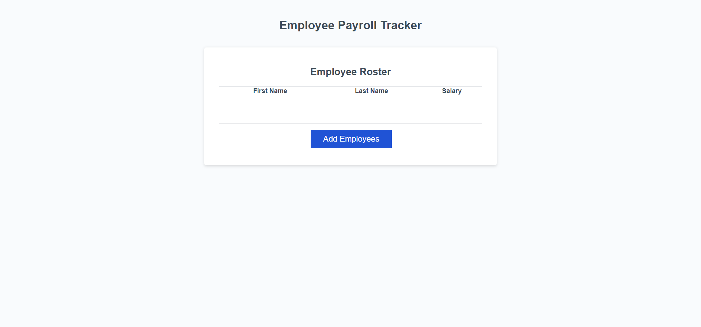
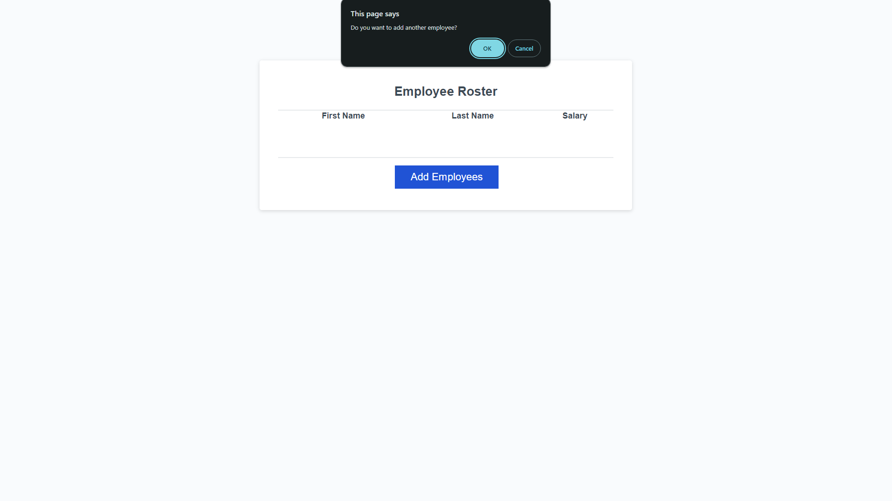
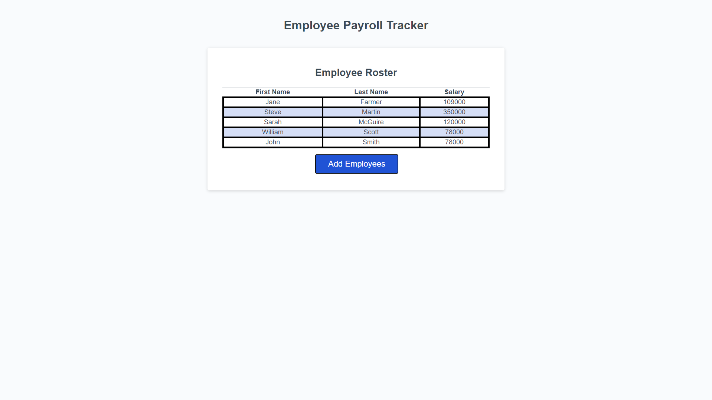
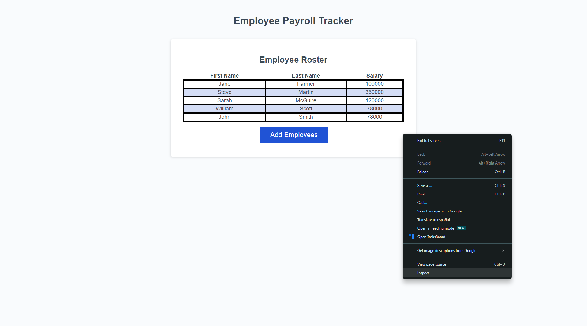
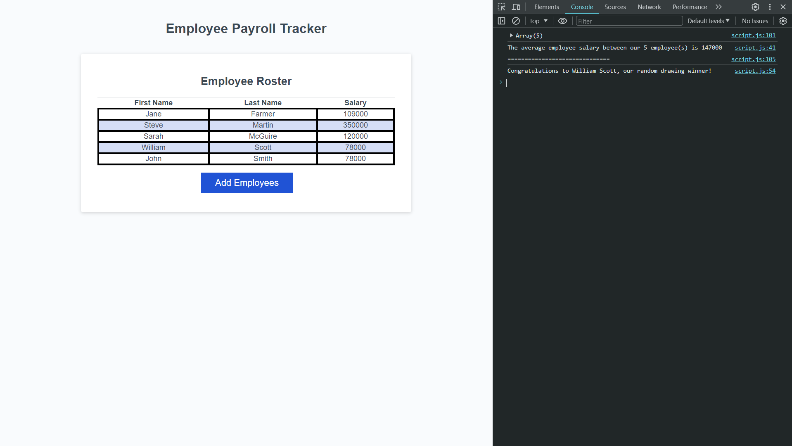
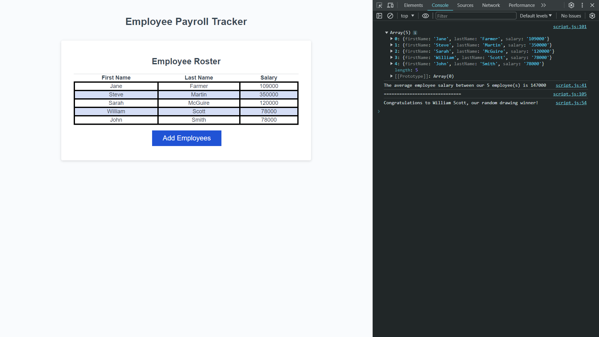

# Employee Payroll Tracker

## Description
This [website](https://jorge-baldovinos.github.io/Employee-Payroll-Tracker/) serves as a tool to create a payroll table by requesting user information and displaying it on the screen. The code was refactored by a boot camp student as part of a project to make the website function properly. The site will gather data that it will later use to calculate the average salary of the added employees. Additionally, the website will choose a random first and last name and announce it as a winner.

## Usage

The user is initially greeted with an empty table containing three empty fields and a blue button labeled "Add Employee".

When the user clicks the blue button, they are prompted to enter three pieces of information: an employee's first name, last name, and salary.

After filling out the required information, the user is asked to confirm whether they want to continue adding employees or stop the input process.

If they choose to continue, they can add multiple employees; if they choose to stop, they will be shown a table displaying all the information they've inputted.

If the user right-clicks the mouse and clicks inspect or presses Ctrl+Shift+I to open the development tools, they can click on the console to see additional information.

Specifically, they will be able to view the average employee salary and a randomly selected employee who has been chosen as the winner.

By clicking on the drop-down arrow next to the word "array", they can also view how all the information has been stored.

## License

Please refer to the LICENSE in the repo.
